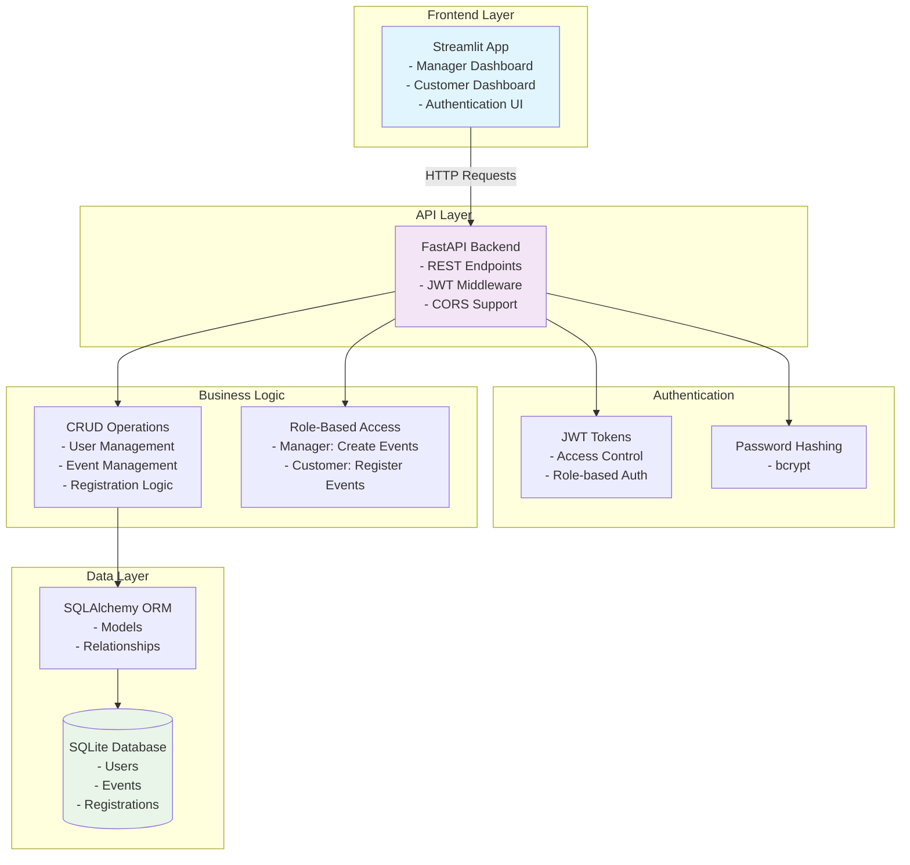
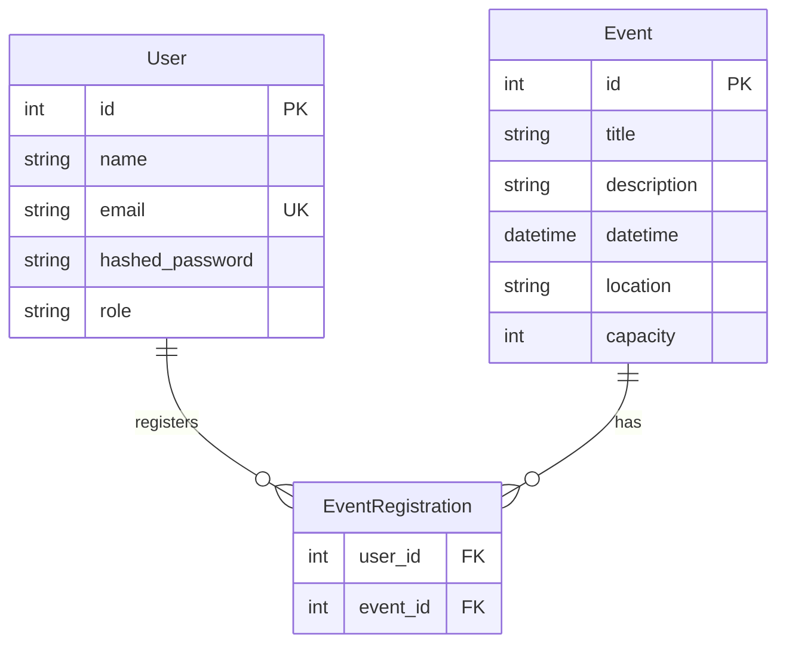

# 🎫 Event Booking System

A full-stack Event Booking System built with FastAPI backend and Streamlit frontend, featuring JWT authentication and role-based access control.

## 🏗️ Architecture Overview



## 🌟 Features

### 🔐 Authentication & Authorization
- **JWT-based Authentication**: Secure token-based auth system
- **Role-based Access Control**: Manager and Customer roles
- **Password Security**: bcrypt hashing for password storage

### 👥 User Management
- User registration with role selection
- Secure login/logout functionality
- Profile management

### 📅 Event Management
- **Managers can:**
  - Create new events
  - View all events with attendee lists
  - Set event capacity and details

- **Customers can:**
  - Browse available events
  - Register for events (with capacity checking)
  - View registration status

### 🔧 Technical Features
- **Capacity Management**: Automatic capacity checking
- **Real-time Updates**: Live registration status
- **Data Validation**: Pydantic schemas for API validation
- **Error Handling**: Comprehensive error responses

## 🛠️ Tech Stack

### Backend
- **FastAPI**: Modern Python web framework
- **SQLAlchemy**: SQL toolkit and ORM
- **SQLite**: Lightweight database
- **JWT**: JSON Web Tokens for authentication
- **bcrypt**: Password hashing
- **Pydantic**: Data validation

### Frontend
- **Streamlit**: Python web app framework
- **Requests**: HTTP library for API calls

## 📁 Project Structure

```
event-booking-system/
├── backend/
│   ├── main.py           # FastAPI app and routes
│   ├── models.py         # SQLAlchemy models
│   ├── schemas.py        # Pydantic schemas
│   ├── database.py       # Database configuration
│   ├── auth.py           # JWT authentication
│   ├── crud.py           # Business logic
│   └── roles.py          # Role-based access control
├── frontend/
│   └── app.py            # Streamlit application
├── requirements.txt      # Python dependencies
├── .gitignore           # Git ignore rules
└── README.md            # This file
```

## 🚀 Quick Start

### Prerequisites
- Python 3.8+
- pip package manager

### Installation

1. **Clone the repository**
   ```bash
   git clone <repository-url>
   cd event-booking-system
   ```

2. **Install dependencies**
   ```bash
   pip install -r requirements.txt
   ```

3. **Start the backend server**
   ```bash
   uvicorn backend.main:app --reload
   ```
   The API will be available at: http://localhost:8000

4. **Start the frontend (in a new terminal)**
   ```bash
   streamlit run frontend/app.py
   ```
   The web app will be available at: http://localhost:8501

## 📚 API Documentation

Once the backend is running, you can access:
- **Interactive API Docs**: http://localhost:8000/docs
- **ReDoc Documentation**: http://localhost:8000/redoc

### Key Endpoints

| Method | Endpoint | Description | Auth Required | Role |
|--------|----------|-------------|---------------|------|
| POST | `/signup` | User registration | ❌ | - |
| POST | `/login` | User authentication | ❌ | - |
| GET | `/events` | List all events | ❌ | - |
| POST | `/events` | Create new event | ✅ | Manager |
| POST | `/register` | Register for event | ✅ | Customer |

## 🗃️ Database Schema



## 🔑 User Roles

### Manager
- Create, view, and manage events
- View attendee lists for events
- Access to event creation dashboard

### Customer
- Browse available events
- Register for events (subject to capacity)
- View personal registration status

## 🧪 Example Usage

### 1. Manager Workflow
1. Sign up with "manager" role
2. Login to access manager dashboard
3. Create events with details and capacity
4. Monitor registrations and attendee lists

### 2. Customer Workflow
1. Sign up with "customer" role (default)
2. Login to access customer dashboard
3. Browse available events
4. Register for desired events

## 🛡️ Security Features

- **Password Hashing**: All passwords are hashed using bcrypt
- **JWT Tokens**: Secure authentication tokens with expiration
- **Role-based Access**: Endpoint protection based on user roles
- **Input Validation**: Pydantic schemas validate all API inputs
- **CORS Protection**: Configured for secure cross-origin requests

## 🔧 Configuration

### Environment Variables
You can customize the following in `backend/auth.py`:
- `SECRET_KEY`: JWT signing secret (change in production)
- `ACCESS_TOKEN_EXPIRE_MINUTES`: Token expiration time
- `ALGORITHM`: JWT algorithm

### Database
The system uses SQLite by default. To use a different database:
1. Update `SQLITE_DATABASE_URL` in `backend/database.py`
2. Install appropriate database drivers

## 🤝 Contributing

1. Fork the repository
2. Create a feature branch
3. Make your changes
4. Add tests if applicable
5. Submit a pull request

## 📄 License

This project is open source and available under the MIT License.

## 🐛 Troubleshooting

### Common Issues

1. **Import Error: email-validator**
   ```bash
   pip install pydantic[email]
   ```

2. **Database not found**
   - The SQLite database is created automatically on first run
   - Check file permissions in the project directory

3. **CORS errors**
   - Ensure both backend and frontend are running
   - Check the API_BASE_URL in frontend/app.py

4. **Token expiration**
   - Tokens expire after 30 minutes by default
   - Re-login if you encounter authentication errors

## 📞 Support

For questions or issues, please create an issue in the repository or contact the development team.
